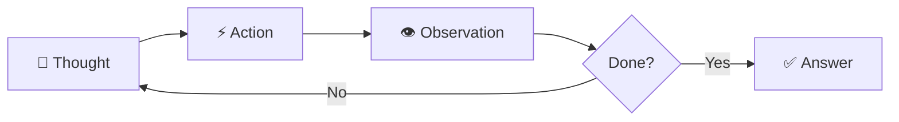

# 🤖 Simple AI Agent

<div align="center">


</div>

<p align="center">
  <em>A powerful AI agent built with LangChain that can search the web 🌐 and retrieve real-time weather information ☁️ using Ollama (local LLM)</em>
</p>

---

## 🎯 Overview

This project implements a **ReAct (Reasoning and Acting)** agent that can:
- 🔍 Search the web using DuckDuckGo
- 🌤️ Fetch real-time weather information for any city
- 🔗 Chain multiple tools together to answer complex queries
- 💡 Think step-by-step to solve problems intelligently

## ✨ Features

- **🌐 Web Search**: Uses DuckDuckGo search to find information on the internet
- **☁️ Weather Information**: Retrieves current weather data including temperature, humidity, wind speed, and conditions
- **🧠 ReAct Agent**: Implements the ReAct pattern for step-by-step reasoning and action
- **💻 Local LLM**: Uses Ollama with Llama 3.1:8b model (no API costs!)
- **🚀 Fast & Efficient**: Runs locally with no external API dependencies for the LLM

## 📋 Prerequisites

- 🐍 Python 3.7+
- 🦙 Ollama installed with the `llama3.1:8b` model
- 🔑 OpenWeatherMap API key

## 🚀 Installation

### Step 1: Install Ollama

Download and install Ollama from [https://ollama.ai](https://ollama.ai) and pull the required model:

```bash
ollama pull llama3.1:8b
```

### Step 2: Install Python Dependencies

```bash
pip install langchain_ollama langchain_community langchain_core duckduckgo-search
```

## ⚙️ Setup

### 1️⃣ Start Ollama

Make sure Ollama is running with the `llama3.1:8b` model:

```bash
ollama run llama3.1:8b
```

### 2️⃣ Configure API Key

Replace the API key in the `get_weather` function inside the notebook:
```python
api_key = 'your-openweathermap-api-key'
```

> 💡 **Tip**: Get your free API key from [OpenWeatherMap](https://openweathermap.org/api)

## 📖 Usage

The notebook demonstrates a complete workflow:

### 1️⃣ Initialize the LLM
### 1️⃣ Initialize the LLM

```python
llm = ChatOllama(model='llama3.1:8b')
```

### 2️⃣ Set up Tools

   - 🔍 DuckDuckGo search tool for web searches
   - ☁️ Custom weather tool for weather information

### 3️⃣ Create the Agent

```python
agent = create_react_agent(
    llm=llm,
    tools=[search_tool, get_weather],
    prompt=prompt
)
```

### 4️⃣ Execute Queries
```python
response = agent_executor.invoke({
    "input": "find the capital of Andhra Pradesh and what is the current weather of that city?"
})
```

## 💡 Example Query

The notebook includes an example that demonstrates the agent's ability to chain multiple operations:

1. 🔍 First, it searches for the capital of Andhra Pradesh (Amaravati/Vijayawada)
2. ☁️ Then, it retrieves the current weather in that city

### Sample Output:
```
🤔 Thought: I need to find the capital of Andhra Pradesh first
🔧 Action: Search for the capital
📊 Observation: The capital is Amaravati
🤔 Thought: Now I need to get the weather
🔧 Action: Get weather for Amaravati
📊 Observation: Temperature: 28°C, Clear sky
✅ Final Answer: The capital of Andhra Pradesh is Amaravati, and the current weather is 28°C with clear skies.
```

## 📁 Project Structure

## 📁 Project Structure

```
Simple AI Agent/
├── 📓 Agent.ipynb          # Main Jupyter notebook with agent implementation
└── 📄 README.md            # This file
```

## 🔄 How It Works

The agent uses the **ReAct pattern**:



1. **💭 Thought**: The agent thinks about what to do next
2. **⚡ Action**: It selects a tool and executes it
3. **👁️ Observation**: It observes the result
4. **🔁 Repeat**: The process continues until the answer is found

## 📦 Dependencies

## 📦 Dependencies

| Package | Purpose |
|---------|---------|
| `langchain_ollama` | 🦙 Ollama integration for LangChain (local LLM) |
| `langchain_community` | 🔍 Community tools including DuckDuckGo search |
| `langchain_core` | 🧩 Core LangChain framework components |
| `langchain` | 🦜 LangChain framework |
| `requests` | 🌐 HTTP library for API calls |
| `duckduckgo-search` | 🦆 DuckDuckGo search integration |

## 📝 Notes

- 📊 The agent runs in **verbose mode** to show the reasoning process
- 💰 Uses Ollama for local LLM inference - **no API costs!**
- 🔐 Weather API key should be kept secure and not committed to version control
- 🌡️ Weather data is provided in **metric units** (Celsius)
- ⚡ Requires Ollama to be running in the background

## 📄 License

This is a demonstration project for educational purposes.

---

<div align="center">

**Built with ❤️ using LangChain 🦜 and Ollama 🦙**

⭐ Star this repo if you find it helpful!

</div>
